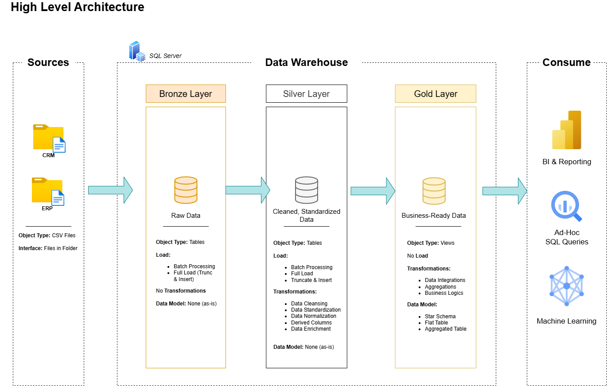
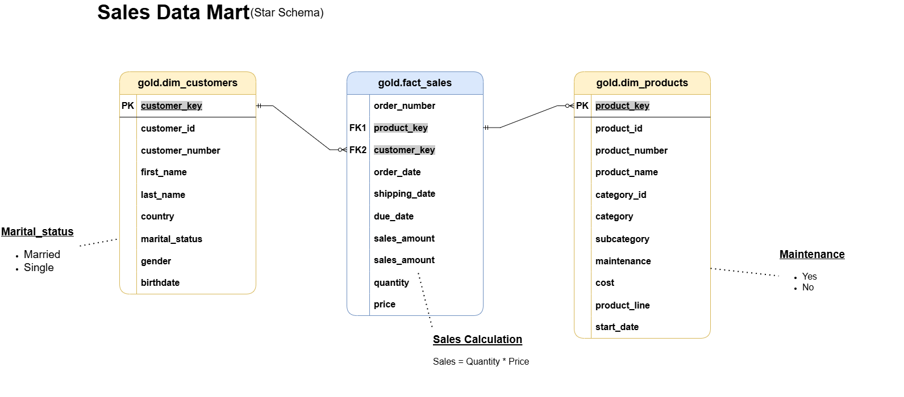

# 🚲 SQL Data Warehouse Case Study — Customer & Sales Data

## 📚 Table of Contents

- [Project Overview](#-project-overview)
- [Business Problem](#-business-problem)
- [Stakeholders & Goals](#-stakeholders--goals)
- [Data Architecture](#-data-architecture)
- [ETL Process](#-etl-process)
- [Data Quality Checks](#-data-quality-checks)
- [Data Modeling (Star Schema)](#-data-modeling-star-schema)
- [Project Structure](#-project-structure)
- [Tools & Stack](#-tools--stack)
- [Project Management](#-project-management)
- [Business Impact & Enablement](#-business-impact--enablement)
- [About Me](#-about-me)
- [License](#-license)
- [Credits](#-credits)


## 📘 Project Overview

As a self-directed data analyst, I created this data engineering project to showcase a complete SQL-based data warehouse solution utilizing the "Medallion Architecture" data framework (Bronze → Silver → Gold) to build an ETL pipeline for a fictional retail company, **Velocity Bikes**. Inspired by a real-world framework taught by *Baraa Khatib Salkini*, I transformed fragmented ERP and CRM data into an analytics-ready star schema to support business intelligence and stakeholder decision-making.

## 🔍 Business Problem

The company could not generate reliable analytics due to fragmented CRM and ERP systems, poor data quality, and inconsistent structures. Stakeholders lacked a unified, queryable environment to support product, customer, and sales reporting. With bad data, it would be harder for analysts & stakeholders to find solutions to crucial business questions like:

* Which products generate the most revenue?
* Who are our most valuable customers?
* What patterns exist in sales across countries and time?
* How can we enable more effective marketing campaigns?

I designed and implemented a modular **SQL data warehouse** to unify raw CRM and ERP datasets. This enabled clean, scalable, and analytics-ready data models for future business intelligence use. This architecture enables analysts and BI developers to confidently explore trends in customer behavior, product performance, and sales over time — without wrestling with dirty source data.


## 🧑‍🏢 Stakeholders & Goals

| Stakeholder            | Goals                                                    |
| ---------------------- | -------------------------------------------------------- |
| Data Analysts          | Needed structured, documented, and reliable tables to run reports and build dashboards without manually cleaning raw CSVs   |
| BI Developers          | Needed a central fact/dim table structure to plug into Power BI/Tableau                                                     |
| IT/Infrastructure	     | Needed schema modularity (bronze/silver/gold) to support versioning, debugging, and scale-up                                |
| Data Engineering Team  | Needed a production-grade architecture that separates raw, clean, and modeled data layers with robust QA                    |

## 🏗️ Data Architecture

This data architecture follows the **Medallion Architecture** using layered schemas:



* **Bronze Layer**: Raw ingestion from source CSVs (`cust_info`, `sales_details`, `prd_info`, `cust_az12`, etc.)
* **Silver Layer**: Cleaned, standardized, and integrated data (e.g. standardizing gender/marital status, deriving product category IDs)
* **Gold Layer**: Star schema views for reporting (`dim_customers`, `dim_products`, `fact_sales`)

## ⭮ ETL Process

ETL was implemented with SQL Server using stored procedures:

### 🔴 Bronze Layer

* Staged raw data from CSV files using `BULK INSERT`
* Scripts: `ddl_bronze.sql`, `proc_load_bronze.sql`

### 🟠 Silver Layer

* Applied business rules and data cleaning:

  * Standardized genders and marital status
  * Parsed and corrected dates
  * Derived sales amount where missing
  * Joined CRM and ERP sources
* Scripts: `ddl_silver.sql`, `proc_load_silver.sql`

### 🟡 Gold Layer

* Created star schema views:

  * `dim_customers`: joined customer data with country, gender, and birthdate
  * `dim_products`: joined product line with category and subcategory info
  * `fact_sales`: order-level metrics with foreign keys to dimensions
* Script: `ddl_gold.sql`

## 🧼 Data Quality Checks

### Silver Layer Checks (`quality_checks_silver.sql`):

* Primary key uniqueness & null checks
* Chronological consistency (`order_dt <= ship_dt <= due_dt`)
* Derived values validated (`sales = quantity * price`)
* Date range checks (birthdates, invalid future dates)
* Standardization of fields (country codes, product lines, gender)

### Gold Layer Checks (`quality_checks_gold.sql`):

* Uniqueness of surrogate keys in dimension tables
* Referential integrity between `fact_sales` and dimension tables
* Orphan checks for foreign keys

## 📜 Data Modeling (Star Schema)



### Dimensions:

* `dim_customers (customer_key)`
* `dim_products (product_key)`

### Fact:

* `fact_sales`

  * Linked via `customer_key`, `product_key`
  * Includes: `order_date`, `sales_amount`, `quantity`, `price`
 
## 🧰 Tools & Stack

* SQL Server 2022 (T-SQL)
* SSMS
* CSV files as data source
* GitHub + Notion for tracking
* Draw\.io for diagrams

## 📁 Project Structure

```
sql_data_warehouse_project/
├── datasets/              # Raw datasets used for the project (CRM and ERP data)
│   ├── source_crm         # CRM datasets (customer info, product info, sales details)
│   ├── source_erp         # ERP datasets (customer demographics, location, product categories)
├── docs/                  # Project documentation and architecture details
├── sql_scripts/
│   ├── init_database.sql  # Script to create the DW database and define bronze, silver, and gold schemas
│   ├── bronze/            # DDL + Load procedures
│   ├── silver/            # Transformations and cleansing scripts
│   └── gold/              # Star schema view creation scripts
├── tests/                 # Silver and Gold QA scripts
├── LICENSE                # MIT License
├── README.md              # (You are here)

```

## 🧰 Tools & Stack

* SQL Server 2022 (T-SQL)
* SSMS
* CSV files as data source
* GitHub + Notion for tracking
* Draw\.io for diagrams

## ✅ Project Management 

(via [Notion](https://www.notion.so/SQL-Data-Warehouse-Project-2056694dac8f80588b53c33e7df890c4?source=copy_link))

By utilizing Notion, I tracked the progress of my project at an epic level to a task level. I enabled structured progress monitoring across all project phases — from data ingestion to QA and modeling. This reinforced agile development practices and ensured each component (ETL, QA, modeling, documentation) was systematically built and reviewed.

Project Epics included:
* Requirement Analysis
* Design Data Architecture
* Project Initialization
* Build Bronze Layer
* Build Silver Layer
* Build Gold Layer

## 💼 Business Impact & Enablement

Although this project does not perform direct business analysis, it lays the critical groundwork for it. By consolidating messy, disconnected ERP and CRM datasets into a unified, structured data warehouse, this project delivers key business enablement outcomes:

- A centralized data platform
- High data quality and trust
- Reusable engineering framework
- Enablement of business-ready insights & reporting


## 👨‍💼 About Me

I'm a data analyst and dance educator passionate about leveraging data to solve real-world business challenges. I completed this project as part of a self-directed portfolio challenge inspired by industry guidance, applying strong data modeling, SQL development, and data quality principles. This project strengthens my portfolio as I transition into more technical roles at the intersection of analytics and data engineering. My goal is to bring both structure and creative storytelling to the way people use data.

## 🛡️ License

This project is licensed under the [MIT License](LICENSE).

## 🙏 Credits

* Framework adapted from [Baraa Khatib Salkini](https://www.datawithbaraa.com/)
* Dataset simulated for learning purposes only
