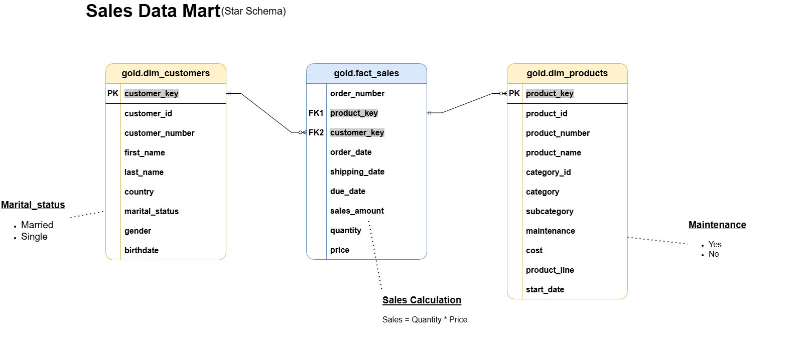

# 🚲 SQL Data Warehouse Case Study — Customer & Sales Analytics

## 📘 Project Overview

This project showcases a complete SQL-based data warehouse solution developed using a Medallion Architecture (Bronze → Silver → Gold) for a fictional retail company, **Velocity Bikes**. Inspired by a real-world framework taught by *Baraa Khatib Salkini*, I transformed fragmented ERP and CRM data into an analytics-ready star schema to support business intelligence and stakeholder decision-making.

## 🔍 Business Problem

The company lacked a centralized, analysis-ready database to answer critical business questions such as:

* Which products generate the most revenue?
* Who are our most valuable customers?
* What patterns exist in sales across countries and time?
* How can we enable more effective marketing campaigns?

## 🧑‍🏢 Stakeholders & Goals

| Stakeholder            | Goals                                                    |
| ---------------------- | -------------------------------------------------------- |
| Chief Revenue Officer  | Maximize product revenue, optimize pricing               |
| Regional Sales Manager | Understand sales by region and product line              |
| Marketing Analyst      | Segment customers for targeted campaigns                 |
| Data Engineering Team  | Build a scalable, clean, and maintainable data warehouse |

## 🏗️ Data Architecture


This data architecture follows the **Medallion Architecture** using layered schemas:

* **Bronze Layer**: Raw ingestion from source CSVs (`cust_info`, `sales_details`, `prd_info`, `cust_az12`, etc.)
* **Silver Layer**: Cleaned, standardized, and integrated data (e.g. standardizing gender/marital status, deriving product category IDs)
* **Gold Layer**: Star schema views for reporting (`dim_customers`, `dim_products`, `fact_sales`)

## ⭮ ETL Process Summary

ETL was implemented with SQL Server using stored procedures:

### 🔴 Bronze Layer

* Staged raw data from CSV files using `BULK INSERT`
* Scripts: `ddl_bronze.sql`, `proc_load_bronze.sql`

### 🟠 Silver Layer

* Applied business rules and data cleaning:

  * Standardized genders and marital status
  * Parsed and corrected dates
  * Derived sales amount where missing
  * Joined CRM and ERP sources
* Scripts: `ddl_silver.sql`, `proc_load_silver.sql`

### 🟡 Gold Layer

* Created star schema views:

  * `dim_customers`: joined customer data with country, gender, and birthdate
  * `dim_products`: joined product line with category and subcategory info
  * `fact_sales`: order-level metrics with foreign keys to dimensions
* Script: `ddl_gold.sql`

## 🧼 Data Quality Checks

### Silver Layer Checks (`quality_checks_silver.sql`):

* Primary key uniqueness & null checks
* Chronological consistency (`order_dt <= ship_dt <= due_dt`)
* Derived values validated (`sales = quantity * price`)
* Date range checks (birthdates, invalid future dates)
* Standardization of fields (country codes, product lines, gender)

### Gold Layer Checks (`quality_checks_gold.sql`):

* Uniqueness of surrogate keys in dimension tables
* Referential integrity between `fact_sales` and dimension tables
* Orphan checks for foreign keys

## 📜 Final Data Model (Star Schema)



### Dimensions:

* `dim_customers (customer_key)`
* `dim_products (product_key)`

### Fact:

* `fact_sales`

  * Linked via `customer_key`, `product_key`
  * Includes: `order_date`, `sales_amount`, `quantity`, `price`

## 📊 Insights Enabled

* Top-selling products and categories
* Customer behavior by region, age, and gender
* Time-based sales trends (e.g., seasonality)
* Regional product performance

## 📁 Project Structure

```
sql_data_warehouse_project/
|
├── datasets/              # Raw datasets used for the project (CRM and ERP data)
|
├── docs/                  # Project documentation and architecture details
|   |── etl.drawio         # Naming conventions, data layer docs
├── sql_scripts/
│   ├── bronze/            # DDL + Load procedures
│   ├── silver/
│   └── gold/
├── quality_checks/        # Silver and Gold QA scripts
├── notion_tracking/       # Task & epic logs from project planner
├── README.md              # (You are here)
```

## 🧰 Tools & Stack

* SQL Server 2022 (T-SQL)
* SSMS
* CSV files as data source
* GitHub + Notion for tracking
* Draw\.io for diagrams

## ✅ Project Progress Tracker (via [Notion](https://www.notion.so/SQL-Data-Warehouse-Project-2056694dac8f80588b53c33e7df890c4?source=copy_link))

By utilizing Notion, I was able to track the progress of my project at an epic-level to a task-level. Which each project epic comes with varying amounts of tasks that have been broken down into minute details.

Project Epics included:
* Requirement Analysis
  * Analyze & Understand the Requirements
* Design Data Architecture
  * Choose Data Management Approach
  * Brainstorm & Design The Layers
  * Draw the Data Architecture (Draw.io)
* Project Initialization
  * Create Detailed Project Tasks (Notion)
  * Define Project Naming Conventions
  * Create GIT Repo & Prepare The Repo Structure
  * Create Database & Schemas
* Build Bronze Layer
* Build Silver Layer
* Build Gold Layer

## 👨‍💼 About Me

I’m a former digital marketer and creative dance director who’s now diving into data. After years of building dance programs, running marketing campaigns, and leading creative projects, I realized how much I enjoy working with data to solve real problems. I’ve been learning tools like SQL, Python, and Tableau through hands-on projects — from building dashboards for a local dance studio to analyzing TikTok data for a classification model. My goal is to bring both structure and creative storytelling to the way people use data.

## 🛡️ License

This project is licensed under the [MIT License](LICENSE).

## 🙏 Credits

* Framework adapted from [Baraa Khatib Salkini](https://www.datawithbaraa.com/)
* Dataset simulated for learning purposes only
